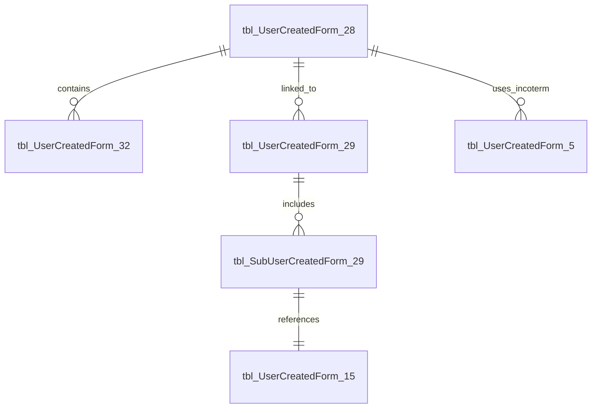

# 📘 Database Schema Explanation

This document explains the structure and relationships in the `FormDesign` database used for generating the LOT-based reports.

---

## 🧱 Schema: `UserForm`

The `UserForm` schema includes over 30 tables representing dynamic sections of a form system. Each table corresponds to a modular sub-form or reference list in the UI.

---

### 🔑 Main Tables

- **tbl_UserCreatedForm_28** – Stores the main LOT entries with basic contract and product information.
- **tbl_UserCreatedForm_29** – Stores contract details such as payment terms, incoterms, and notes.
- **tbl_SubUserCreatedForm_29** – Holds subcontract-specific data (unit price, packages, packaging info).

#### 📋 Example: `tbl_UserCreatedForm_28` 

| Column Name     | Type        | Description                       |
|-----------------|-------------|-----------------------------------|
| fldColumn_1     | NVARCHAR     | Contract Number                   |
| fldColumn_3     | NVARCHAR     | LOT Number                        |
| fldColumn_6     | NVARCHAR     | Product Details                   |
| fldColumn_8     | NUMERIC      | Net Weight (LOT)                  |
| fldColumn_9     | NUMERIC      | Gross Weight (LOT)                |
| fldColumn_11    | DATE         | Shipment Date of PO               |
| ...             | ...          | ...                               |

---

### 📎 Relation & Lookup Tables

- **tbl_UserCreatedForm_32** – Relates contracts with LOT numbers and product details.
- **tbl_UserCreatedForm_1**, **27** – Store descriptions for contract terms and requirement documents.
- **tbl_UserCreatedForm_5**, **6**, **14**, etc. – Standard lookups for Incoterms, Payment Terms, Destination Ports.
- **tbl_UserCreatedForm_15** – Product master data including grades and categories.

---

### 🧮 Functions and Helpers

- **`dbo.PersianDate(@date)`** – Converts Gregorian dates to Persian (Jalali) format.

---

### 🔄 Relationships

Forms are linked primarily through these fields:

- `fldColumn_X` – Foreign key references (typically numeric or GUID)
- `fldSubkeyGroupReletionID` – Used in join tables to maintain associations
- `fldID` – Primary keys (often of type UNIQUEIDENTIFIER)

---

### 📊 Entity Relationship Diagram (simplified)

> This diagram shows simplified relationships based on actual join logic.

---

### ⚙️ Data Challenges

- Many foreign keys are stored as text or loosely typed values
- Dates and boolean flags need transformation before reporting
- Some fields (like required documents) are pipe-separated and require `STRING_SPLIT` for expansion
- Inconsistent use of NULL and empty strings can affect joins and filters

---

## 📑 Usage Recommendation

- Ensure all lookup/reference tables are populated before query execution
- Create proper indexes on `fldID`, `fldColumn_X`, and `fldSubkeyGroupReletionID`
- Validate values in fields before applying filters or aggregations

---
